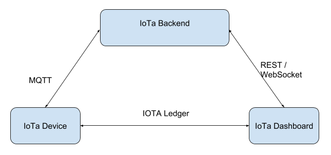
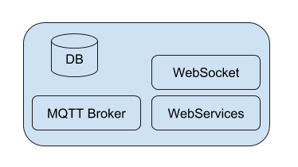

# iota-backend

## How to configure

First you have to set the environment:

```
$ npm install
```

Second you need mosquitto mqtt Broker.
When you get it with your favorite packages manager start mosquitto on port 3883.
N.B. Some systems when you install mosquitto from package manager start it as service on standard port (1883).
Our project require mosquitto on port 3883 beacuse it bring up the MQTT broker trought Mosca on port 1883.

```
$ mosquitto -p 3883
```

## How to use

```
$ node index.js
```

## Theory about Backend element

### Intro
L’elaborato che abbiamo deciso di scrivere per testare iota si compone di tre principali elementi:
- IoTa Backend.
- IoTa Board.
- IoTa Dashboard.

L’idea è costruire un sistema che permetta ad un sensore di manifestare la propria presenza sul cloud 
e che permetta ad una Dashboard di interagire con quest’ultimo on demand.



### Backend



Al fine di creare una scenario IoT verosimile abbiamo sviluppato una piccola app in node.js che offre i servizi di storage, broker MQTT e WebServer (REST + WebSocket).
L’idea generale è che il backend esponga un servizio MQTT per i “devices”, un servizio che consenta, da un lato, a tutti i sensori e/o agli aggregatori di sensori di manifestare la propria presenza nel network IoT, dall’altro a tutti gli utilizzatori di reperire le informazioni riguardanti i device disponibili al fine di essere in grado di instaurare una connessione end to end con essi.
Il device durante la fase di bootstrap manifesta la sua presenza al backend via mqtt al topic “/device”.

```javascript
mqttServer.on('published', function (packet, client) {
    console.log('[INFO] MQTT client Published at ' + new Date());

    console.log(packet.payload.toString());
    if(packet.topic === 'devices')
    {
      let alreadyExist = false;
      let data = JSON.parse(packet.payload.toString());
      console.log(data);
      for(let i=0;i<devices.length;i++)
      {
          if(devices[i].root===data.root){
              alreadyExist=true;
          }
      }
      if(!alreadyExist){
        devices.push(data);
        io.emit("devices", devices);
      }
    }
});
```

Dall’altra parte l’api REST esposta dal web server permetterà agli utilizzatori di questa infrastruttura, per esempio ad una WebApp di prendere informazioni sui dispositivi per poi essere in grado di instaurare una connessione.

```javascript
app.get('/devices', function (req, res){
    let onlineDevices = db.collection('devices').find();
    res.json(onlineDevices);
});
```

Parallelamente la stessa operazione può essere fatta via WebSocket, alla connessione di un client sul socket o alla pubblicazione di un nuovo device via mqtt.

```javascript
io.on('connection', (socket) => {
    console.log('[INFO] WebSocket user connected');
  
    io.emit("devices", devices);
    ...

});
```
